# 门禁控制系统 (door_project)

**项目愿景**: 基于CH32V30x RISC-V平台的智能门禁系统，支持多种认证方式（RFID卡、指纹、密码），提供实时监控、权限管理和远程控制功能。

**主控芯片**: CH32V307VCT6 (RISC-V 32-bit, 144MHz)
**项目类型**: 嵌入式IoT - 智能门禁系统
**文档版本**: v1.0.0
**最后更新**: 2026-02-05

---

## 变更记录 (Changelog)

| 日期 | 版本 | 变更内容 | 作者 |
|------|------|----------|------|
| 2026-02-05 | v1.0.0 | 初始化AI上下文，创建项目架构文档 | Claude AI |

---

## 架构总览

### 技术栈

- **硬件平台**: CH32V307VCT6 (RISC-V, 144MHz, 256KB Flash, 64KB RAM)
- **开发工具**: MounRiver Studio, RISC-V GCC, WCH-Link调试器
- **架构模式**: 裸机开发，协作式调度器（5ms时间片）
- **通信接口**: UART x4, SPI x2, I2C x2, Ethernet

### 分层设计

```
┌─────────────────────────────────────────────────┐
│          应用层 (Application Layer)              │
│  门禁业务逻辑 | 权限管理 | 数据记录 | UI控制      │
└──────────────────┬──────────────────────────────┘
                   ↓
┌─────────────────────────────────────────────────┐
│         中间层 (Middleware Layer)                │
│  协议解析 | 环形缓冲 | 状态机 | 调度器           │
└──────────────────┬──────────────────────────────┘
                   ↓
┌─────────────────────────────────────────────────┐
│          驱动层 (Driver/BSP Layer)               │
│  RFID | 指纹 | LCD | 门控 | UART DMA | Timer    │
└──────────────────┬──────────────────────────────┘
                   ↓
┌─────────────────────────────────────────────────┐
│        硬件抽象层 (HAL Layer)                    │
│  CH32V30x 外设库 (Peripheral Library)           │
└─────────────────────────────────────────────────┘
```

---

## 模块结构图 (Mermaid)

```mermaid
graph TD
    A["(根) door_project"] --> B["Core/"];
    A --> C["Peripheral/"];
    A --> D["User/"];
    A --> E["Debug/"];
    A --> F["Startup/"];
    A --> G["docs/"];

    B --> B1["core_riscv.c/h<br/>RISC-V内核"];

    C --> C1["inc/<br/>外设头文件"];
    C --> C2["src/<br/>外设源文件"];

    D --> D1["应用入口<br/>main.c"];
    D --> D2["调度器<br/>scheduler.c/h"];
    D --> D3["UART DMA<br/>usart1_dma_rx.c/h"];
    D --> D4["环形缓冲<br/>ringbuffer_large.c/h"];
    D --> D5["RFID驱动<br/>rfid_reader.c/h"];
    D --> D6["指纹识别<br/>as608.c/h"];
    D --> D7["LCD驱动<br/>lcd.c/h"];
    D --> D8["门控模块<br/>door_control.c/h"];
    D --> D9["按键/LED<br/>key_app/led"];

    E --> E1["debug.c/h<br/>串口调试"];

    F --> F1["startup_ch32v30x_D8.S<br/>启动文件"];

    G --> G1["硬件文档<br/>hardware_pinout.md"];
    G --> G2["AS608移植<br/>as608_*.md"];
    G --> G3["RFID文档<br/>RFID_*.md"];

    click D1 "./User/CLAUDE.md" "查看 User 模块文档"
    click C1 "./Peripheral/CLAUDE.md" "查看 Peripheral 模块文档"
    click B1 "./Core/CLAUDE.md" "查看 Core 模块文档"
    click G1 "./docs/README.md" "查看文档索引"
```



---

## 模块索引

| 模块 | 路径 | 职责 | 语言 | 状态 |
|------|------|------|------|------|
| **Core** | `Core/` | RISC-V内核文件 | C | ✅ 稳定 |
| **Peripheral** | `Peripheral/` | CH32V30x外设库 | C | ✅ 稳定 |
| **User** | `User/` | 用户应用代码 | C | 🔄 开发中 |
| **Debug** | `Debug/` | 串口调试模块 | C | ✅ 稳定 |
| **Startup** | `Startup/` | RISC-V启动文件 | Assembly | ✅ 稳定 |
| **Ld** | `Ld/` | 链接脚本 | Linker Script | ✅ 稳定 |
| **docs** | `docs/` | 项目文档 | Markdown | 🔄 持续更新 |

详细模块文档：
- [User 模块详情](./User/CLAUDE.md) - 应用层核心代码
- [Peripheral 模块详情](./Peripheral/CLAUDE.md) - 外设驱动库
- [Core 模块详情](./Core/CLAUDE.md) - RISC-V内核
- [文档索引](./docs/README.md) - 完整技术文档

---

## 运行与开发

### 快速开始

1. **环境准备**
   ```bash
   # 安装MounRiver Studio IDE
   # 下载地址: http://www.wch.cn/downloads/MounRiver_Studio_Setup_exe.html

   # 安装RISC-V GCC工具链（MounRiver Studio自带）
   # 连接WCH-Link调试器到开发板
   ```

2. **编译项目**
   ```bash
   # 在MounRiver Studio中打开项目
   # 或使用命令行编译
   cd F:\door_project\door_project_1\door_project
   make all
   ```

3. **烧录固件**
   - 使用MounRiver Studio的下载功能
   - 或使用WCH-LinkUtility工具

4. **调试输出**
   - 串口工具: SecureCRT / PuTTY
   - 配置: 115200 bps, 8N1
   - 连接: USART1 (PA9-Tx, PA10-Rx)

### 主程序入口

**文件**: `User/main.c`

**初始化流程**:
```c
int main(void) {
    // 1. 系统初始化
    NVIC_PriorityGroupConfig(NVIC_PriorityGroup_2);
    SystemCoreClockUpdate();
    Delay_Init();

    // 2. 外设初始化
    led_init();
    scheduler_init();
    USART1_DMA_RX_FullInit(115200, &g_usart1_ringbuf);
    TIM_1ms_Init();

    // 3. 门禁模块初始化
    door_control_init();
    menu_init();  // LCD菜单系统
    key_init();
    matrix_key_init();

    // 4. 认证模块初始化
    BY8301_Init();  // 语音模块
    RFID_Init(115200);
    RFID_SetWorkMode(RFID_MODE_AUTO_ID_BLOCK, 8, 2000);

    // 5. 启动调度器
    TIM_1ms_Start();
    while (1) {
        scheduler_run();  // 5ms周期任务调度
    }
}
```

---

## 核心功能

### 1. 认证系统

- **RFID卡识别**: 13.56MHz高频卡（Mifare S50/S70）
- **指纹识别**: AS608光学/电容式模块
- **密码输入**: 矩阵键盘输入

### 2. 门禁控制

- **舵机控制**: TIM3 PWM输出，角度控制
- **状态管理**: 状态机管理锁定/解锁状态
- **超时自动锁**: 可配置自动关门时间

### 3. 人机交互

- **LCD显示**: ST7735S彩屏，128x160像素
- **菜单系统**: 纯C实现的菜单框架
- **语音提示**: BY8301语音模块
- **LED指示**: 状态指示灯

### 4. 数据管理

- **UART DMA接收**: 三级缓冲零CPU接收
- **环形缓冲区**: 1024字节缓冲深度
- **记录存储**: 外部Flash存储开门记录（待实现）

---

## 测试策略

### 单元测试

- 串口DMA接收验证
- LCD显示功能验证

### 集成测试

- 刷卡识别流程测试
- 指纹验证流程测试
- 门禁控制状态转换测试

### 硬件测试

参考文档：
- [硬件引脚连接](./docs/hardware_pinout.md)
- [硬件配置检查报告](./docs/Hardware_Configuration_Check_Report.md)

---

## 编码规范

### 命名约定

```c
// 全局变量：g_前缀
ringbuffer_large_t g_usart1_ringbuf;

// 静态变量：s_前缀
static uint32_t s_rx_count = 0;

// 宏定义：全大写
#define UART_BUFFER_SIZE 256

// 函数：模块名_功能_动作
void USART1_DMA_RX_Init(void);
uint8_t RFID_Read_CardID(uint32_t* id);

// 结构体：小写+_t后缀
typedef struct {
    uint32_t timestamp;
} access_record_t;
```

### 代码风格

- **缩进**: 4空格（禁用Tab）
- **大括号**: K&R风格
- **注释**: Doxygen格式函数注释

### 头文件管理（必须遵守）

**统一头文件**: `User/bsp_system.h` 是全项目的唯一入口头文件，包含所有标准库、芯片库、驱动和业务模块的声明。

**规则**:
1. **所有 .c 文件只 include `bsp_system.h`**，禁止直接 include 其他项目头文件
2. **新增模块时**，将新模块的 .h 文件添加到 `bsp_system.h` 的对应分组中
3. **例外**: `system_ch32v30x.c`（芯片库）和 `ch32v30x_it.c`（需额外 include `ch32v30x_it.h`）

**bsp_system.h 分组结构**:
```
标准库       → stdio.h, string.h, stdint.h, stdbool.h, stdlib.h, ctype.h ...
芯片库       → ch32v30x.h, debug.h
系统模块     → timer_config.h, scheduler.h
通信驱动     → ringbuffer_large.h, usart1_dma_rx.h, uart3_dma_rx.h
外设驱动     → led.h, key_app.h, lcd_init.h, lcd.h, lcdfont.h
功能模块     → door_control.h, as608.h, by8301.h, rfid_reader.h
任务模块     → uart_rx_task.h, rfid_task.h, simple_menu_c.h, menu_task.h
认证系统     → user_database.h, access_log.h, password_input.h, auth_manager.h ...
WiFi/MQTT   → esp8266_config.h, esp_at.h, esp8266.h, esp8266_mqtt.h
```

**新增模块示例**:
```c
// 1. 新建 User/new_module.h 和 User/new_module.c
// 2. 在 bsp_system.h 对应分组中添加:
#include "new_module.h"
// 3. new_module.c 中只写:
#include "bsp_system.h"
```

详细规范参考: [技术架构文档](./.spec-workflow/steering/tech.md)

---

## AI 使用指引

### 项目理解

1. **从入口开始**: 阅读 `User/main.c` 了解初始化流程
2. **查看调度器**: `User/scheduler.c` 理解任务调度机制
3. **外设驱动**: 查看 `User/` 下各驱动文件

### 常见任务

- **添加新外设**: 参考 [硬件引脚文档](./docs/hardware_pinout.md) 检查引脚占用
- **修改门禁逻辑**: 编辑 `User/door_control.c`
- **调整LCD界面**: 修改 `User/menu_task.c`
- **UART通信**: 使用 `User/usart1_dma_rx.c` 提供的API

### 重要约束

- **定时器资源**: TIM2被调度器占用，TIM3被舵机占用
- **DMA通道**: DMA1_Channel5被USART1占用
- **内存限制**: RAM仅64KB，避免大数组
- **实时性要求**: 任务执行时间 < 2ms

---

## 扩展计划

- [ ] 外部Flash存储管理（W25Q128）
- [ ] 网络通信模块（Ethernet）
- [ ] 人脸识别模块集成
- [ ] 云平台对接（MQTT/HTTP）
- [ ] 移动端APP开发

---

## 相关资源

- **官方文档**: [CH32V307数据手册](http://www.wch.cn/downloads/CH32V307DS0_PDF.html)
- **开发工具**: [MounRiver Studio](http://www.wch.cn/downloads/MounRiver_Studio_Setup_exe.html)
- **产品需求**: [PRD文档](./.spec-workflow/steering/product.md)
- **技术架构**: [技术文档](./.spec-workflow/steering/tech.md)
- **文档索引**: [docs/README.md](./docs/README.md)

---

**AI提示**: 本项目采用裸机开发，核心是5ms协作式调度器。关键技术包括UART DMA三级缓冲、状态机管理和模块化驱动设计。
