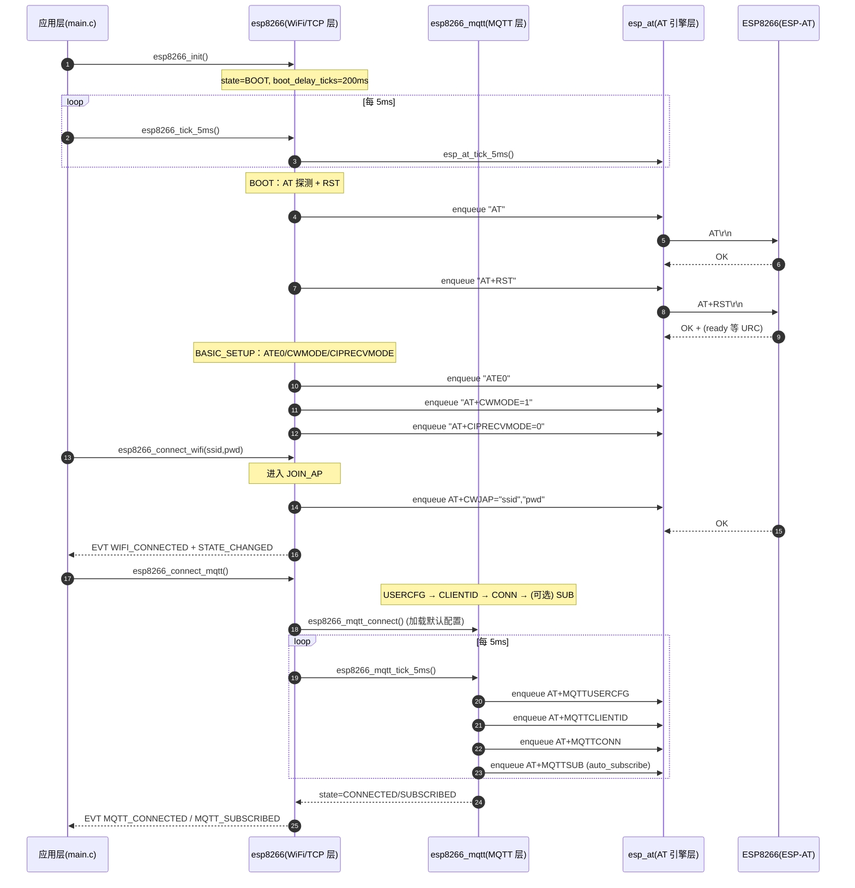

# ESP8266 WiFi/MQTT 模块技术架构（门禁控制系统）

本文档面向**不阅读源码**的开发者，解释门禁控制系统中 ESP8266（ESP-AT 固件）WiFi/MQTT 模块的整体工作框架、初始化流程、分层职责、状态机、URC（Unsolicited Result Code，异步上报码）处理机制，以及关键 API 的使用方法。

源码入口与文件范围：

- 配置：`User/esp8266_config.h`
- AT 引擎层：`User/esp_at.h`、`User/esp_at.c`
- WiFi/TCP 层：`User/esp8266.h`、`User/esp8266.c`
- MQTT 层：`User/esp8266_mqtt.h`、`User/esp8266_mqtt.c`
- 系统集成示例：`User/main.c`

---

## 1. 概述

### 1.1 模块用途

该模块在门禁控制系统中承担“联网与上云控制”职责：

- 通过 UART 连接 ESP8266（运行 ESP-AT 固件），使用 AT 命令完成 WiFi 入网、TCP 连接或 MQTT 连接与订阅。
- 通过 MQTT 接收云端下发命令（例如远程开锁、上报状态），并向云端发布门禁状态数据。
- 采用**非阻塞**（non-blocking）设计：所有动作由 5ms 周期 `tick` 驱动，无 `delay()` 等阻塞等待。

### 1.2 在系统中的角色（典型调用链）

系统启动时（见 `User/main.c`）：

- 初始化 UART1 + DMA 接收环形缓冲；
- `esp8266_init()` 初始化 WiFi/MQTT 模块；
- 注册事件回调与 MQTT 消息回调；
- 调用 `esp8266_connect_wifi(...)` 与 `esp8266_connect_mqtt()` 触发入网与 MQTT 连接；
- 调度器持续运行，5ms 任务周期调用 `esp8266_tick_5ms()` 推进状态机。

---

## 2. 硬件接口

### 2.1 UART 与引脚

ESP8266 使用 `USART1` 与 MCU 通信：

- 波特率：`115200 bps`（见 `User/main.c` 中 `USART1_DMA_RX_FullInit(115200, ...)`）
- 引脚：
  - `PA9`：`USART1_TX`
  - `PA10`：`USART1_RX`

### 2.2 DMA 接收与中断

UART1 接收采用 DMA 循环模式提升吞吐与降低 CPU 负担（见 `User/usart1_dma_rx.c`）：

- DMA：`DMA1 Channel5`（`DMA1_Channel5`）
- 模式：`DMA_Mode_Circular`（循环）
- 中断：
  - `DMA1_Channel5_IRQn`：半满（HT）与全满（TC）中断
  - `USART1_IRQn`：空闲中断（IDLE line）用于不定长数据包边界处理

### 2.3 与软件层的接口

AT 引擎通过两个底层 IO 函数与 UART 层解耦（见 `User/esp8266.c` 中 `esp_at_init(&io, ...)`）：

- `USART1_TX_Write(const uint8_t *data, uint16_t len)`：尽可能发送并返回已写入字节数（用于非阻塞 TX）
- `USART1_RX_ReadByte(uint8_t *data)`：从 RX 环形缓冲读取 1 字节（无数据时返回非 0）

---

## 3. 架构设计

### 3.1 三层分层架构

模块采用“三层非阻塞架构”：

1) AT 引擎层（`esp_at`）
- 统一管理 AT 命令队列、超时、响应匹配、prompt（`>`）处理、`+IPD` 数据分发、URC 上报。

2) WiFi/TCP 层（`esp8266`）
- 驱动模块上电初始化与基础配置；
- 驱动 WiFi 入网（`AT+CWJAP`）；
- 驱动 TCP 连接与发送（`AT+CIPSTART` / `AT+CIPSEND`）；
- 汇聚 URC，处理掉线回退，并作为 MQTT 层的宿主（可切换到 MQTT 模式）。

3) MQTT 层（`esp8266_mqtt`）
- 基于 ESP-AT MQTT 指令集（`AT+MQTT*`）实现 MQTT 连接配置、连接、订阅、发布；
- 解析 `+MQTTSUBRECV` 订阅消息并回调给应用层。

### 3.2 架构图（Mermaid）

```mermaid
flowchart TB
  App[应用层：门禁业务\n(main.c / door_control / auth_manager ...)]
  ESP[WiFi/TCP 层：esp8266\n状态机 + 事件回调]
  MQTT[MQTT 层：esp8266_mqtt\nUSERCFG/CLIENTID/CONN/SUB/PUB]
  AT[AT 引擎层：esp_at\n命令队列 + 6 阶段状态机 + URC 分发]
  UART[UART1 + DMA RX\nPA9/PA10 + DMA1_CH5\nRingBuffer + 非阻塞 TX]
  MOD[ESP8266 模块\nESP-AT 固件]

  App -->|API 调用| ESP
  App -->|MQTT 消息回调| MQTT
  ESP -->|驱动| MQTT
  ESP -->|enqueue AT 命令| AT
  MQTT -->|enqueue AT 命令| AT
  AT -->|write/read_byte| UART
  UART <--> MOD
  AT -->|URC_LINE / URC_IPD / URC_PROMPT| ESP
  ESP -->|URC_LINE 转交| MQTT
```

---

## 4. 模块详解

## 4.1 AT 引擎层（esp_at）

### 4.1.1 设计目标

- 全程非阻塞：发送采用“分 tick 续发”，接收采用“逐字节解析 + tick 预算限制”。
- 命令队列：可并发提交命令请求（队列长度默认 `ESP_AT_QUEUE_LEN = 12`）。
- 统一响应判定：基于行（line）解析判定 `OK/ERROR/FAIL/SEND OK/SEND FAIL`。
- URC 上报：**所有接收行均上报**给上层（便于做日志、状态判定），同时支持 `+IPD` payload 流式上报。

### 4.1.2 命令队列机制

核心数据结构（见 `User/esp_at.h`）：

- `esp_at_cmd_t`
  - `cmd/cmd_len`：AT 命令字符串（自动补齐 `\r\n`）
  - `timeout_ticks`：命令阶段超时（5ms tick）
  - `payload/payload_len`：可选 payload（用于 `AT+CIPSEND`）
  - `wait_prompt`：是否等待 `>` prompt
  - `wait_send_ok`：发送 payload 后是否等待 `SEND OK/SEND FAIL`
  - `done_cb(user)`：命令完成回调（OK/ERROR/TIMEOUT）

入队 API：

- `esp_at_enqueue_cmd(...)`：普通命令（等待 `OK/ERROR`）
- `esp_at_enqueue_cmd_with_payload(...)`：带 payload 命令（等待 `>` → 发送 payload → 等待 `SEND OK`）

关键约束（零拷贝）：

- `payload` 指针不会被拷贝；调用方必须保证在命令完成回调前 payload 内存保持有效（见 `User/esp_at.h` 的 note）。

### 4.1.3 6 阶段状态机（phase）

AT 引擎内部用 6 个阶段描述一条命令的生命周期（见 `User/esp_at.c` 的 `esp_at_phase_t`）：

1. `ESP_AT_PHASE_IDLE`：空闲，等待队列出队下一条命令
2. `ESP_AT_PHASE_TX_CMD`：发送 AT 命令字符串（分 tick 续发）
3. `ESP_AT_PHASE_WAIT_PROMPT`：等待 `>` prompt（用于 `CIPSEND`）
4. `ESP_AT_PHASE_TX_PAYLOAD`：发送 payload（分 tick 续发）
5. `ESP_AT_PHASE_WAIT_RESP`：等待 `OK/ERROR/FAIL`（普通命令）
6. `ESP_AT_PHASE_WAIT_SEND_OK`：等待 `SEND OK/SEND FAIL`（payload 场景）

阶段推进由 `esp_at_tick_5ms()` 驱动（见 `User/esp_at.c` 的函数注释与实现），核心顺序是：

1) 继续发送未发完的数据（`esp_at_try_send_pending()`）  
2) 接收并解析数据（每 tick 最多处理 `ESP_AT_RX_BUDGET_PER_TICK` 字节，默认 256）  
3) 超时递减（`timeout_ticks` 归零触发 `TIMEOUT`）  
4) 如空闲则启动下一条命令（出队 → 进入 `TX_CMD`）  
5) 立即尝试再发一次（避免额外等待 1 个 tick）

### 4.1.4 行解析与 URC（异步上报）

AT 引擎把接收内容分为三类 URC（见 `User/esp_at.h` 的 `esp_at_urc_type_t`）：

- `ESP_AT_URC_LINE`：普通文本行（以 `\n` 结束的行，`esp_at` 内部拼装成以 `\0` 结尾字符串）
- `ESP_AT_URC_IPD`：`+IPD` 或 `+CIPRECVDATA` payload（不走行解析，按字节流直接下发）
- `ESP_AT_URC_PROMPT`：发送 prompt（检测到行首 `>`，可带一个空格 `"> "`）

`+IPD` payload 处理要点（见 `User/esp_at.c`）：

- 识别头部 `+IPD,...:` 或 `+CIPRECVDATA,...:`，解析 payload 长度；
- 随后进入 payload 模式：后续字节不再进行 `\r\n` 行解析；
- payload 以分块方式上报：内部 chunk 大小为 64 字节，可能多次触发 `ESP_AT_URC_IPD` 回调。

---

## 4.2 WiFi/TCP 层（esp8266）

### 4.2.1 公开状态与事件

对外暴露的核心枚举（见 `User/esp8266.h`）：

- 状态 `esp8266_state_t`：
  - `DISABLED`、`BOOT`、`BASIC_SETUP`、`JOIN_AP`、`TCP_CONNECT`、`ONLINE`
  - `MQTT_*`：`MQTT_DISCONNECTED`、`MQTT_CONFIGURING`、`MQTT_CONNECTING`、`MQTT_CONNECTED`、`MQTT_SUBSCRIBED`
  - `ERROR`

- 事件 `esp8266_event_t`（通过 `esp8266_set_callbacks()` 注册）：
  - `ESP8266_EVENT_STATE_CHANGED`：任何状态变化都会触发
  - `ESP8266_EVENT_WIFI_CONNECTED / WIFI_DISCONNECTED`
  - `ESP8266_EVENT_TCP_CONNECTED / TCP_DISCONNECTED`
  - `ESP8266_EVENT_TCP_SEND_OK / TCP_SEND_FAIL`
  - `ESP8266_EVENT_MQTT_CONNECTED / MQTT_DISCONNECTED / MQTT_SUBSCRIBED`
  - `ESP8266_EVENT_ERROR`

### 4.2.2 初始化与基础配置（BOOT → BASIC_SETUP）

`esp8266_init()` 完成三件事（见 `User/esp8266.c`）：

1) 绑定底层 IO，初始化 AT 引擎：`io.write = USART1_TX_Write`、`io.read_byte = USART1_RX_ReadByte`，并注册 URC 回调 `esp8266_at_urc_cb(...)`。  
2) 初始化 MQTT 子模块：`esp8266_mqtt_init()`。  
3) 设置状态机起点：进入 `BOOT`，并设置上电等待 `boot_delay_ticks = 40`（200ms）。

BOOT 状态的启动序列（由 `esp8266_tick_5ms()` 驱动）：

- 先等待上电稳定（200ms）；
- 发送探测 `AT`：
  - 成功：短延时 10ms 后进入 `AT+RST`；
  - 失败：延时 100ms 后重试 `AT`（避免上电瞬间无响应）；
- `AT+RST` 成功后切到 `BASIC_SETUP`，并延时 100ms 以等待模块输出 `ready` 等 URC。

基础配置 `BASIC_SETUP` 的 step 序列（AT 引擎空闲时推进）：

1) `ATE0`：关闭回显  
2) `AT+CWMODE=1`：Station 模式  
3) `AT+CIPRECVMODE=0`：主动接收模式（通过 `+IPD` 推送数据）

完成后：

- 若已经请求连接 WiFi（`wifi_req=1`），进入 `JOIN_AP`；
- 否则停留在 `BASIC_SETUP` 等待上层调用 `esp8266_connect_wifi()`。

### 4.2.3 WiFi 入网（JOIN_AP）

触发方式：

- 上层调用 `esp8266_connect_wifi(ssid, password)`：
  - 保存 SSID/Password；
  - 置 `wifi_req=1`、`wifi_connected=0`；
  - 若当前处于在线/连接相关状态，会把状态切回 `JOIN_AP` 重新发起连接。

JOIN_AP 内部行为（AT 引擎空闲时）：

- 发送 `AT+CWJAP="ssid","pwd"`，超时设置为 20s；
- 成功：置 `wifi_connected=1`，触发 `ESP8266_EVENT_WIFI_CONNECTED`，并进入下一阶段：
  - 若处于 MQTT 模式（`mqtt_req=1`）：进入 `MQTT_CONFIGURING`
  - 否则：进入 `TCP_CONNECT`
- 失败：保持 `JOIN_AP` 并触发 `ESP8266_EVENT_ERROR`（等待上层重试或下次 tick 再发起）

### 4.2.4 TCP 连接与发送（TCP_CONNECT / ONLINE）

触发方式：

- 上层调用 `esp8266_tcp_connect(host, port)`：
  - 如果当前已经在 MQTT 模式，会先请求 MQTT 断开并退出 MQTT 模式；
  - 保存 host/port；
  - 置 `tcp_req=1`、`tcp_connected=0`；
  - 如果之前已经连接，会设置 `tcp_need_close=1`（先 `CIPCLOSE` 再 `CIPSTART`）。

TCP_CONNECT 行为（AT 引擎空闲时）：

- 如果 `tcp_need_close=1`：先发 `AT+CIPCLOSE`，然后再进入 `CIPSTART`；
- 否则发起 `AT+CIPSTART="TCP","host",port`，超时 10s；
- 成功：置 `tcp_connected=1`，触发 `ESP8266_EVENT_TCP_CONNECTED`，进入 `ONLINE`。

ONLINE 状态下发送数据：

- `esp8266_tcp_send(data, len)`：
  - 只允许在 `ONLINE && tcp_connected==1`；
  - 要求 AT 引擎空闲（`esp_at_is_idle()==1`），避免 payload 生命周期难以管理；
  - 通过 `esp_at_enqueue_cmd_with_payload("AT+CIPSEND=len", payload, ...)` 实现零拷贝发送；
  - 完成后触发 `ESP8266_EVENT_TCP_SEND_OK` 或 `ESP8266_EVENT_TCP_SEND_FAIL`。

### 4.2.5 WiFi/TCP 状态机：11 个关键状态转换（含触发条件）

下面按“从上电到上线、再到掉线回退”的视角，列出最关键的 11 个转换（覆盖 BOOT/SETUP/JOIN/TCP/ONLINE 以及 MQTT 切换点）：

1) `BOOT` → `BOOT`：上电稳定等待（`boot_delay_ticks` 倒计时）  
2) `BOOT` → `BOOT`：发送 `AT` 探测（AT 引擎空闲时触发）  
3) `BOOT` → `BASIC_SETUP`：`AT+RST` 成功后切换  
4) `BASIC_SETUP` → `JOIN_AP`：`wifi_req=1` 且基础配置完成  
5) `JOIN_AP` → `TCP_CONNECT`：`CWJAP` 成功且 `mqtt_req=0`  
6) `JOIN_AP` → `MQTT_CONFIGURING`：`CWJAP` 成功且 `mqtt_req=1`  
7) `TCP_CONNECT` → `ONLINE`：`CIPSTART` 成功（TCP 建联）  
8) `ONLINE` → `TCP_CONNECT`：URC 包含 `CLOSED` 且 `tcp_req=1`（需要重连）  
9) `任意状态` → `JOIN_AP`：URC 包含 `WIFI DISCONNECT`（WiFi 掉线，TCP/MQTT 也会被认为断开并回退）  
10) `ONLINE/TCP_CONNECT` → `JOIN_AP`：上层调用 `esp8266_connect_mqtt()` 且 WiFi 未连接（先入网）  
11) `ONLINE` → `MQTT_CONFIGURING`：上层调用 `esp8266_connect_mqtt()` 且 WiFi 已连接（进入 MQTT 连接流程）

说明：

- 模块没有单独把“拿到 IP（WIFI GOT IP）”作为状态节点，而是以 `CWJAP` 成功作为“WiFi 可用”的判定点。
- “MQTT over TCP”的底层 TCP 建联发生在 `AT+MQTTCONN` 内部，因此 MQTT 模式下不会进入 `TCP_CONNECT/ONLINE`。

---

## 4.3 MQTT 层（esp8266_mqtt）

### 4.3.1 MQTT 状态机与目标

MQTT 层的状态（见 `User/esp8266_mqtt.h`）：

- `DISCONNECTED`
- `CONFIGURING`
- `CONNECTING`
- `CONNECTED`
- `SUBSCRIBED`
- `ERROR`

设计特点：

- 同样是纯 tick 驱动（`esp8266_mqtt_tick_5ms()`）。
- 所有 AT 命令通过 AT 引擎发送，且要求 `esp_at_is_idle()==1` 才会推进下一步。
- 连接流程被拆成“配置”和“连接”两段，避免大命令失败后难以定位原因。

### 4.3.2 连接配置流程（USERCFG → CLIENTID → CONN → SUB）

当上层调用 `esp8266_mqtt_connect()`（或 WiFi/TCP 层调用 `esp8266_connect_mqtt()` 时间接触发）：

- 加载默认配置（来自 `User/esp8266_config.h`）：
  - broker host/port、username/password、client_id、keepalive、clean_session、订阅 topic/qos、是否自动订阅等；
- 置 `connect_req=1`，并把 MQTT 状态强制回到 `DISCONNECTED`，等待 tick 推进。

`esp8266_mqtt_tick_5ms()` 推进逻辑（简化）：

1) `DISCONNECTED` → `CONFIGURING`：开始配置流程（重置 `cfg_step=0`）  
2) `CONFIGURING`：
   - `cfg_step=0`：发送 `AT+MQTTUSERCFG=...`（USERCFG）
   - `cfg_step=1`：发送 `AT+MQTTCLIENTID=...`（CLIENTID）
   - 完成后进入 `CONNECTING`
3) `CONNECTING`：发送 `AT+MQTTCONN=...`（CONN），成功后进入 `CONNECTED`
4) `CONNECTED/SUBSCRIBED`：若 `subscribe_req=1`，发送 `AT+MQTTSUB=...`（SUB），成功后进入 `SUBSCRIBED`

断开流程（CLEAN）：

- 上层调用 `esp8266_mqtt_disconnect()` 后，tick 在 AT 引擎空闲时发送 `AT+MQTTCLEAN=<link_id>`，完成后回到 `DISCONNECTED`。

### 4.3.3 发布与订阅

发布（`AT+MQTTPUB`）：

- `esp8266_mqtt_publish(topic, payload, len, qos, retain)`
- 仅允许在 `CONNECTED/SUBSCRIBED` 状态；
- payload 会把 `\\` 与 `"` 做转义（避免破坏 AT 命令字符串）；
- 同一时刻仅允许 1 个 publish in-flight（`publish_busy`），且要求 AT 引擎空闲。

订阅（`AT+MQTTSUB`）：

- `esp8266_mqtt_subscribe(topic, qos)` 设置订阅请求（`subscribe_req=1`），由 tick 在合适时机发起；
- 支持“自动订阅”：若配置开启且默认订阅主题非空，则 connect 时会自动置 `subscribe_req=1`。

### 4.3.4 `+MQTTSUBRECV` 与连接相关 URC

WiFi/TCP 层会把所有 `ESP_AT_URC_LINE` 文本行转交给 MQTT 层处理（见 `esp8266_at_urc_cb()` → `esp8266_mqtt_handle_urc_line(line)`）。

MQTT 层识别的关键 URC：

- `+MQTTSUBRECV:`：订阅消息上报（解析 topic 与 payload，并触发 `on_message(topic, payload, len)` 回调）
- `+MQTTDISCONNECTED` / `MQTT DISCONNECTED`：认为连接已断开，回到 `DISCONNECTED`
- `+MQTTCONNECTED`：认为连接已建立，切到 `CONNECTED`（若已订阅则切到 `SUBSCRIBED`）

---

## 5. 完整工作流程（从上电到 MQTT 订阅成功）

下面给出“上电 → 初始化 → 入网 → MQTT 连接 → 订阅成功”的完整序列（应用层只需要按顺序调用 API，不需要理解内部 AT 命令细节）。

### 5.1 初始化序列（BOOT → SETUP → JOIN_AP → MQTT_CONNECTED）



### 5.2 关于 “TCP” 阶段的说明

文档标题中的 “TCP” 阶段有两种含义：

1) **显式 TCP 模式**：应用调用 `esp8266_tcp_connect()` 后，模块进入 `TCP_CONNECT → ONLINE`，并用 `CIPSTART/CIPSEND` 工作。  
2) **MQTT over TCP**：应用调用 `esp8266_connect_mqtt()` 后，底层 TCP 建联由 `AT+MQTTCONN` 内部完成，状态体现在 `MQTT_CONNECTING → MQTT_CONNECTED`，不会进入 `TCP_CONNECT/ONLINE`。

---

## 6. 关键 API 速查表

> 返回值约定：`0` 通常表示“请求已受理/成功”，`-1` 表示“参数或状态不允许/失败”。AT 引擎层使用 `esp_at_result_t` 表示更细粒度原因。

### 6.1 WiFi/TCP 层（esp8266.h）

| API | 参数 | 返回值 | 用途 |
|---|---|---:|---|
| `esp8266_init()` | 无 | `void` | 初始化模块（绑定 AT 引擎 IO、初始化 MQTT 子模块、进入 BOOT） |
| `esp8266_tick_5ms()` | 无 | `void` | 5ms 调度入口：推进 AT 引擎与 WiFi/TCP/MQTT 状态机 |
| `esp8266_set_callbacks(on_rx,on_evt,user)` | `on_rx`：TCP 收包回调；`on_evt`：事件回调 | `void` | 注册应用层回调 |
| `esp8266_connect_wifi(ssid,password)` | SSID、密码（ASCII） | `0/-1` | 请求连接 WiFi（异步） |
| `esp8266_tcp_connect(host,port)` | 域名/IP、端口 | `0/-1` | 请求连接 TCP（异步，切换到 TCP 模式） |
| `esp8266_tcp_send(data,len)` | 数据指针、长度 | `0/-1` | 在线状态下异步发送（零拷贝） |
| `esp8266_connect_mqtt()` | 无 | `0/-1` | 切换到 MQTT 模式并发起连接（必要时先断开 TCP） |
| `esp8266_disconnect_mqtt()` | 无 | `0/-1` | 请求断开 MQTT（发起 `MQTTCLEAN`） |
| `esp8266_get_state()` | 无 | `esp8266_state_t` | 查询当前状态 |
| `esp8266_reset()` | 无 | `void` | 软复位状态机（清空队列并回到 BOOT，不硬复位 ESP8266） |

### 6.2 MQTT 层（esp8266_mqtt.h）

| API | 参数 | 返回值 | 用途 |
|---|---|---:|---|
| `esp8266_mqtt_init()` | 无 | `void` | 初始化 MQTT 子模块（加载默认配置） |
| `esp8266_mqtt_tick_5ms()` | 无 | `void` | 5ms 推进 MQTT 状态机（通常由 `esp8266_tick_5ms()` 间接调用） |
| `esp8266_mqtt_connect()` | 无 | `0/-1` | 按 `esp8266_config.h` 默认配置发起连接 |
| `esp8266_mqtt_disconnect()` | 无 | `0/-1` | 发起断开（`MQTTCLEAN`） |
| `esp8266_mqtt_publish(topic,payload,len,qos,retain)` | 主题、消息、长度、QoS、retain | `0/-1` | 发布消息（AT+MQTTPUB，payload 会转义 `\\` 与 `"`） |
| `esp8266_mqtt_subscribe(topic,qos)` | 主题、QoS | `0/-1` | 请求订阅（异步，tick 内执行 AT+MQTTSUB） |
| `esp8266_mqtt_set_on_message(cb,user)` | 回调 | `void` | 注册订阅消息回调（`+MQTTSUBRECV`） |
| `esp8266_mqtt_get_state()` | 无 | `esp8266_mqtt_state_t` | 查询 MQTT 子模块状态 |

### 6.3 AT 引擎层（esp_at.h）

| API | 参数 | 返回值 | 用途 |
|---|---|---:|---|
| `esp_at_init(io, urc_cb, urc_user)` | IO 函数 + URC 回调 | `void` | 初始化 AT 引擎，绑定 UART 读写与 URC 上报出口 |
| `esp_at_tick_5ms()` | 无 | `void` | 5ms tick：推进发送、接收解析、超时与队列出队 |
| `esp_at_enqueue_cmd(cmd, timeout_ms, done_cb, user)` | 命令、超时、完成回调 | `ESP_AT_RES_*` | 入队普通命令（等待 `OK/ERROR`） |
| `esp_at_enqueue_cmd_with_payload(cmd, cmd_timeout_ms, payload, payload_len, payload_timeout_ms, done_cb, user)` | 命令 + payload | `ESP_AT_RES_*` | 入队带 payload 命令（等待 `>` + `SEND OK`） |
| `esp_at_is_idle()` | 无 | `0/1` | 判断 AT 引擎是否完全空闲（无 in-flight、无队列、无待发送残留） |
| `esp_at_reset()` | 无 | `void` | 清空队列并复位解析状态 |

---

## 7. 集成示例（初始化、回调注册、MQTT 发布与接收）

下面给出一个“最小可用”的集成片段，结构与 `User/main.c` 一致，但去掉与门禁业务无关的部分。

```c
#include "bsp_system.h"

static void on_esp_event(esp8266_event_t evt, esp8266_state_t state, void *user)
{
    (void)user;
    switch (evt)
    {
    case ESP8266_EVENT_STATE_CHANGED:
        printf("[ESP] state=%d\r\n", (int)state);
        break;
    case ESP8266_EVENT_WIFI_CONNECTED:
        printf("[ESP] WiFi connected\r\n");
        break;
    case ESP8266_EVENT_WIFI_DISCONNECTED:
        printf("[ESP] WiFi disconnected\r\n");
        break;
    case ESP8266_EVENT_MQTT_CONNECTED:
        printf("[ESP] MQTT connected\r\n");
        break;
    case ESP8266_EVENT_MQTT_SUBSCRIBED:
        printf("[ESP] MQTT subscribed\r\n");
        break;
    case ESP8266_EVENT_ERROR:
        printf("[ESP] ERROR, state=%d\r\n", (int)state);
        break;
    default:
        break;
    }
}

static void on_mqtt_msg(const char *topic, const uint8_t *payload, uint16_t len, void *user)
{
    (void)user;
    printf("[MQTT] topic=%s len=%u\r\n", topic, (unsigned)len);

    /* 示例：收到 "status" 则回发 JSON */
    if (len >= 6 && memcmp(payload, "status", 6) == 0)
    {
        const char *json = "{\"locked\":1}";
        esp8266_mqtt_publish(ESP8266_MQTT_PUB_TOPIC,
                             (const uint8_t *)json, (uint16_t)strlen(json),
                             ESP8266_MQTT_DEFAULT_QOS,
                             ESP8266_MQTT_DEFAULT_RETAIN);
    }
}

int main(void)
{
    /* 1) 系统与调试串口初始化（略） */
    USART_Printf_Init(115200);

    /* 2) 初始化 USART1 + DMA RX（ESP8266 使用 USART1: PA9/PA10, 115200） */
    USART1_DMA_RX_FullInit(115200, &g_usart1_ringbuf);

    /* 3) 初始化 ESP8266 模块并注册回调 */
    esp8266_init();
    esp8266_set_callbacks(NULL, on_esp_event, NULL);
    esp8266_mqtt_set_on_message(on_mqtt_msg, NULL);

    /* 4) 发起连接请求（异步） */
    esp8266_connect_wifi(ESP8266_WIFI_SSID, ESP8266_WIFI_PASSWORD);
    esp8266_connect_mqtt();

    /* 5) 把 esp8266_tick_5ms() 放入 5ms 调度任务 */
    while (1)
    {
        /* 伪代码：你的调度器每 5ms 调用一次 */
        esp8266_tick_5ms();
        Delay_Ms(5);
    }
}
```

提示：

- 工程中推荐把 `esp8266_tick_5ms()` 放入调度器的 5ms 任务，而不是在 `while(1)` 中 `Delay_Ms(5)`。
- `esp8266_tick_5ms()` 内部已经调用 `esp_at_tick_5ms()`，无需重复调用 AT 引擎 tick。

---

## 8. 注意事项

### 8.1 零拷贝发送与并发限制

- `esp8266_tcp_send()` 与 `esp_at_enqueue_cmd_with_payload()` 采用零拷贝：**payload 指针必须在发送完成事件回调前保持有效**。
- TCP 发送接口强制要求 `esp_at_is_idle()==1` 才允许发送，避免队列堆积导致 payload 生命周期难以管理。
- MQTT publish 同样要求 AT 引擎空闲，且同一时刻仅允许一个 publish in-flight（`publish_busy`）。

### 8.2 URC 与回调调用频率

- `+IPD` payload 会以 64 字节 chunk 形式多次回调 `ESP_AT_URC_IPD`（因此 `on_rx` 回调要能处理“分片到达”）。
- `ESP_AT_URC_LINE` 会上报所有行（包括命令响应行与 URC 行）；上层如果需要日志，可直接打印该行。
- MQTT 的 `+MQTTSUBRECV` 也是通过 `ESP_AT_URC_LINE` 转发到 MQTT 层解析。

### 8.3 超时配置与可调参数

推荐通过 `User/esp8266_config.h` 调整 MQTT 相关超时与默认参数：

- 连接超时：`ESP8266_MQTT_CONN_TIMEOUT_MS`
- 订阅超时：`ESP8266_MQTT_SUB_TIMEOUT_MS`
- 发布超时：`ESP8266_MQTT_PUB_TIMEOUT_MS`
- 命令超时：`ESP8266_MQTT_CMD_TIMEOUT_MS`

AT 引擎的接收预算可通过宏调整（见 `User/esp_at.h`）：

- `ESP_AT_RX_BUDGET_PER_TICK`：每 5ms tick 最多解析的 RX 字节数（默认 256）

### 8.4 机密信息

`User/esp8266_config.h` 内包含 SSID、WiFi 密码、MQTT Username/Password 等敏感信息。建议：

- 不在日志或文档中直接输出真实凭据；
- 生产环境用安全方式注入配置（例如编译时替换、外部存储或安全区域）。

